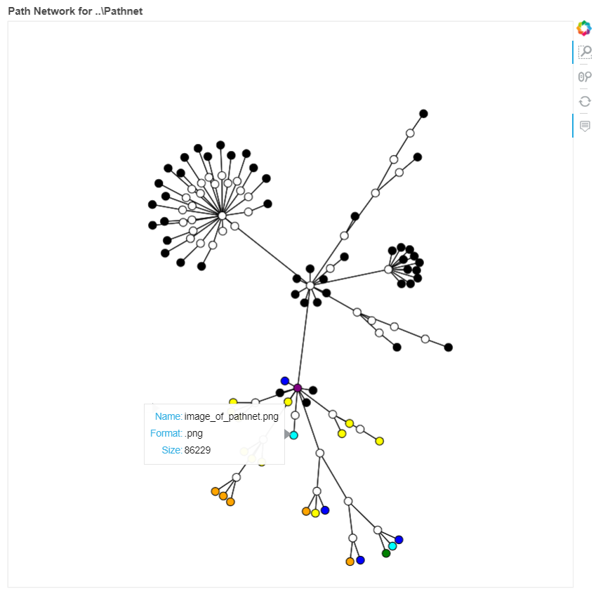

# PathNet
Network graphs for directories
> Quick peak to the structure of a directory or a folder.

> Network Graph, Python 3



---

## Features
-  Plot files and directories in a directory using Matplotlib or Bokeh.
-  Set maximum depth and count of files to prevent over plotting.
-  Color different file types.

---

## Prerequisites

```
Python 3
Bokeh
NetworkX
Matplotlib
```

---


## Installation

Clone this repository typing to your git terminal:
```
git clone https://github.com/Miksus/PathNet.git
```

---

## Author

* **Mikael Koli** - [Miksus](https://github.com/Miksus) - koli.mikael@gmail.com

---

## License

This project is licensed under the MIT License - see the [LICENSE](LICENSE) file for details
